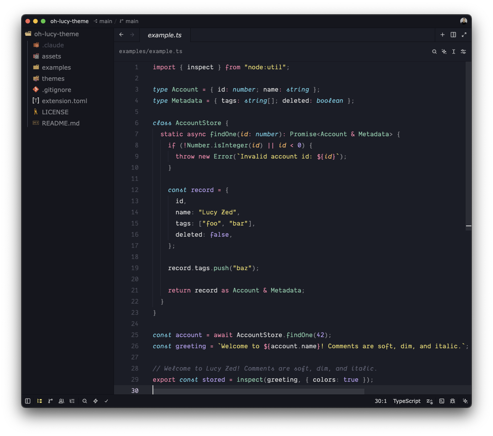
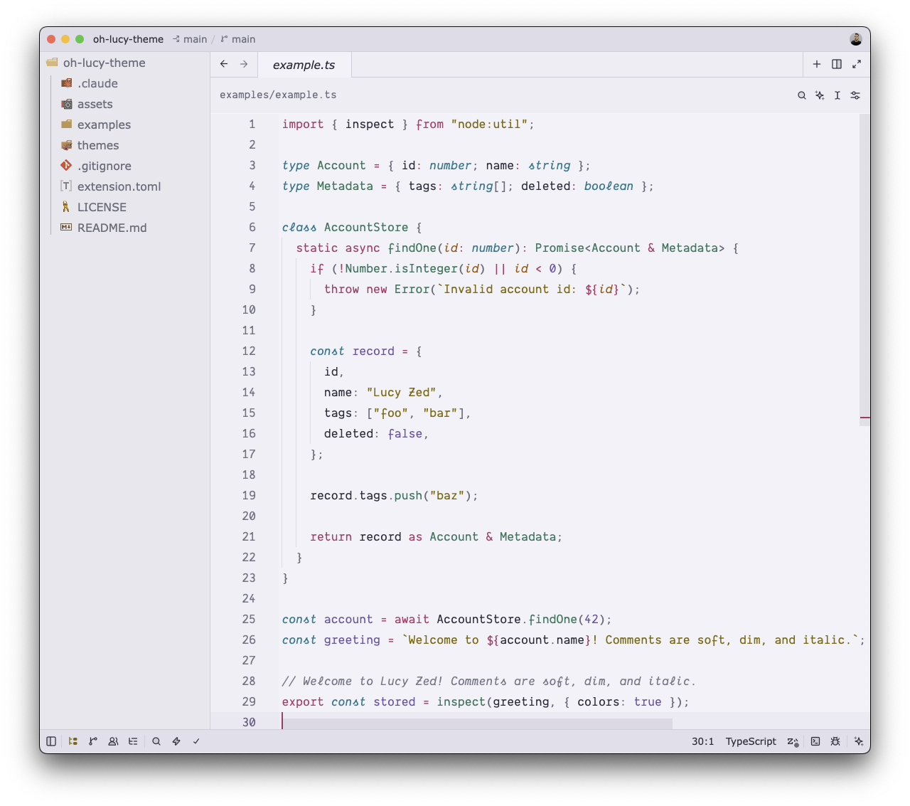

# Oh Lucy Theme for Zed

Lucy is a soft but clear dark theme that has passed through a few caring hands. [Juliette Prétot](https://github.com/jul-sh) knitted the [original Lucy](https://github.com/jul-sh/lucy-vscode-theme) for VS Code, [hermitter](https://github.com/hermitter) gave it a second home under the name [Oh Lucy](https://github.com/hermitter/oh-lucy-vscode-theme), and this project carries it, color by color, to [Zed](https://zed.dev). This collection focuses on a faithful port of the originals and expands the palette with Dawn, Midnight, and Day variants.

Five variants are included:

- **Lucy**: the original theme
- **Lucy Evening**: the original's warmer evening companion
- **Lucy Dawn**: new in this port, the same palette under a cool pre-dawn light
- **Lucy Midnight**: new in this port, deeper and darker for late nights
- **Lucy Day**: new in this port, and the first light Lucy anywhere. The same hues, deepened until they read comfortably on a pale lavender-gray page

## Screenshots

The four dark variants at a glance:

<details>
<summary>Full-size screenshots</summary>

<br>

### Lucy


### Lucy Evening


### Lucy Dawn


### Lucy Midnight


### Lucy Day


</details>

The screenshots show a small TypeScript file that touches the theme's signature tokens: italic cyan declaration keywords, purple constants, green types and function calls, pink keywords, and yellow strings.

## Installation

Until the extension is on the Zed registry, install it as a dev extension:

1. Clone this repo.
2. In Zed, run `zed: install dev extension` from the command palette and pick the repo's root directory.
3. Choose a variant via `theme selector: toggle` (search "Lucy").

## Recommended settings

One of Lucy's nicest touches is that a `const` name is purple where it's declared and plain where it's used. Zed's tree-sitter highlighting can't tell those two apart, but its LSP semantic tokens can. Add this to your Zed `settings.json` and restart the language server (`editor: restart language server`):

```json
{
  "semantic_tokens": "combined",
  "global_lsp_settings": {
    "semantic_token_rules": [
      {
        "token_type": "class"
      },
      {
        "token_type": "variable",
        "token_modifiers": ["declaration", "readonly"],
        "style": ["constant"]
      }
    ]
  }
}
```

### Semantic tokens
#### With semantic tokens


#### Without semantic tokens


Two things worth knowing:

- The empty `class` rule needs to stay first. Zed only treats a rule without a style as "don't apply semantic styling" when it's the highest-priority rule, and that's what lets tree-sitter keep class names green when used as types and plain when used in expressions. Zed's default rules would otherwise paint both the same.
- Without these settings, or when no language server is running, const names simply render white like other variables. Nothing breaks.

## Credits

- [Juliette Prétot](https://github.com/jul-sh) created the original [Lucy theme](https://github.com/jul-sh/lucy-vscode-theme).
- [hermitter](https://github.com/hermitter) maintains the [Oh Lucy re-upload](https://github.com/hermitter/oh-lucy-vscode-theme) this port was built from.

Licensed MIT, preserving the original copyright.
